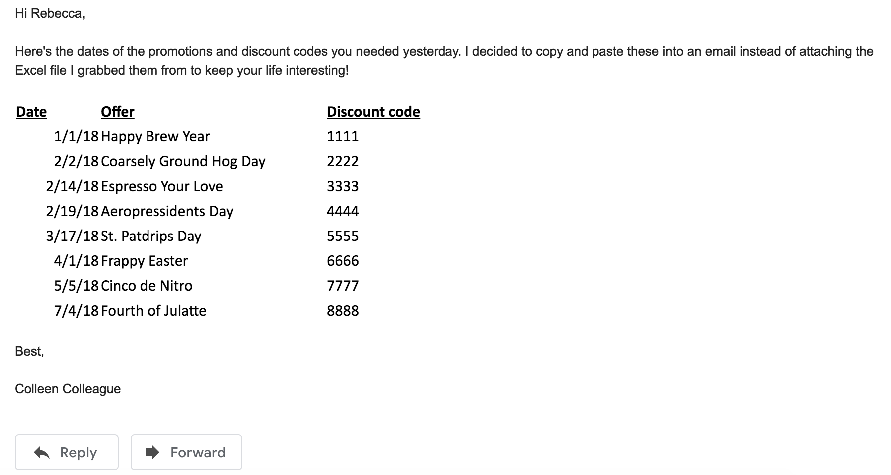

Improving youR quality of life with RStudio addins
========================================================
author: Rebecca Ferrell for R-Ladies Seattle
date: August 20, 2018
autosize: true

who R you?
===
incremental: true

- useR since 2007
    + 😐 useR before 2014
    + 😄 useR since!
- data therapist (statistical consultant)
- data barista (lead decision scientist at ⭐💵)
- Twitter: [@ferrellr](https://twitter.com/ferrellr), Github: [@rebeccaferrell](https://github.com/rebeccaferrell/)

why R you here today?
===
left: 40%
incremental: true

❤️ about R:

- reproducibility!
- extensibility!
- community!

***

😫 about R:

- customizing graphics
- bringing in weird little data fast
- interactively checking data analysis
- everything with factor manipulation

what R RStudio addins?
===

- addins use R's ❤️ aspects to smooth over the 😫
    + **encapsulate functions to write code for you**
    + can be invoked through menus or keyboard shortcuts
    + many have Shiny GUI!
- available in RStudio since 2016

Official site: <https://rstudio.github.io/rstudioaddins/>

befoRe addins: finding colors
===

afteR addins: colourpicker by Dean Attali
===

shoRtcuts
===

life is a tapestRy
===

conveRting with datapasta by Miles McBain
===

R you feeling this yet?
===

  

giphyr addin by Hao Zhu
===

befoRe addins: unexpected NA
===

afteR addins: ViewPipeSteps by David Ranzolin
===

gRaphs with ggThemeAssist by Calli GRoss
===

questionR for recoding by Julien BarnieR
===

wheRe to go next?
===

- try out [`colourpicker`](https://github.com/daattali/colourpicker), [`datapasta`](https://github.com/MilesMcBain/datapasta), [`giphyr`](https://github.com/haozhu233/giphyr), [`ViewPipeSteps`](https://github.com/daranzolin/ViewPipeSteps), [`ggThemeAssist`](https://github.com/calligross/ggthemeassist), [`questionr`](https://juba.github.io/questionr/index.html)
- consider [including addins for your own packages](https://www.rstudio.com/resources/webinars/understanding-add-ins/) using `rstudioapi` 
- visit the [`addinslist` package site](https://github.com/daattali/addinslist) to list your addins via pull request or discover more!

R you excited?
===

  
